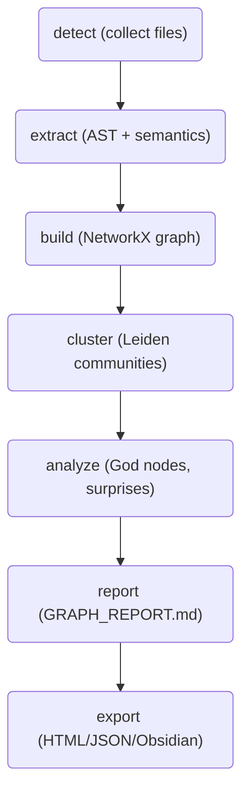
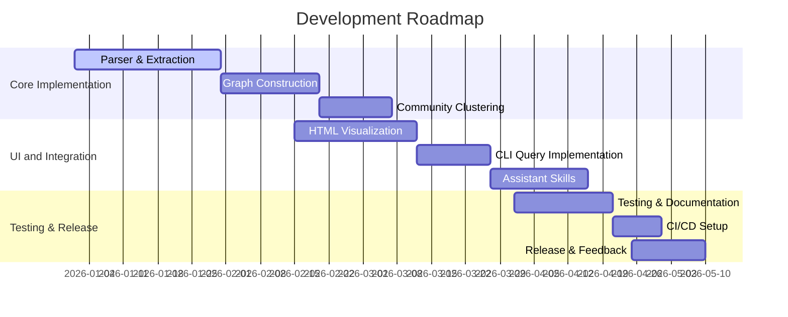

# Executive Summary  
Graphify is an open‐source **AI coding assistant skill** that ingests an entire codebase (plus docs, SQL schemas, scripts, images, PDFs, etc.) and constructs a **queryable knowledge graph** of the project.  It is delivered as a Python CLI (`pip install graphifyy` → `graphify` command) and can integrate with LLM-based assistants (e.g. Claude Code, Codex, Copilot) via installable “skills”.  Features include AST-based extraction of code entities (functions, classes, files, docs) using [tree-sitter] parsers, building a NetworkX graph of the project, community detection (Leiden clustering) to group related concepts, and rich querying (shortest paths, subgraphs, explanations).  The tool produces an **interactive visualization** (`graph.html`) and a markdown report (`GRAPH_REPORT.md`) summarizing key nodes, “god” concepts, and surprises.  Graphify is **MIT-licensed** (free for any use) and emphasizes local-first operation: it **never sends raw source code externally**, only semantic summaries to the user’s own LLM API.  

# (1) Project Overview: Features, Goals, and Use Cases  
- **Knowledge-Graph Construction:** Graphify scans all files in a folder (code in many languages, docs, spreadsheets, images, videos, etc.) to **extract entities and relations**.  Entities include files, classes, functions, variables, database schemas, topics from text/PDFs, etc. Relations include “calls”, “imports”, “defines”, “references”, and even hyperedges (e.g. topics linking to multiple nodes).  
- **AI Assistant Integration:** Once built, the graph can be queried via Graphify’s CLI or AI assistant commands. For example, in a Claude- or Copilot-style chat, a user can type `/graphify` or invoke the Graphify skill, and ask natural-language questions about the codebase (e.g. *“What does function X do?”*, *“How does module A relate to module B?”*). Graphify uses graph traversals and LLMs (only on semantic descriptions, not code) to answer these. Several *skill manifests* are provided for platforms like Claude, Codex, Copilot, Aider, etc.  
- **Graph Queries:** Key query features include **shortest-path** between two nodes, **neighborhood subgraphs** for a term, **BFS/DFS question answering** (`graphify query`), **explain a node** with context, and **“affected”** (reverse impact) queries. These operations traverse the NetworkX graph efficiently (BFS up to token limits).  
- **Visualization & Reports:** Graphify outputs an interactive **vis.js** visualization (`graph.html`) showing the project graph, complete with node-size (degree), community colors, and confidence-styled edges. It also writes `GRAPH_REPORT.md` summarizing “god nodes” (high-degree or central concepts) and surprising edges. These help developers explore their codebase at a glance.  
- **Local-first & Security:** Importantly, Graphify **does not leak code**. Only semantic tags or summaries (e.g. function descriptions) are sent to an AI. The tool validates inputs (e.g. restricting URLs to http/https, size/time limits, HTML-escaping labels) to prevent XSS/SSRF/Cypher injection. Use cases include *code understanding*, *onboarding*, *architectural analysis*, *refactoring support*, and feeding structured context to AI copilots.

# (2) Architecture and Components  

Graphify is a **multi-stage pipeline** of isolated modules. The main stages (see below) illustrate the flow:  



- **`detect.py`**: Scans the project folder, discovering code/files of interest (supports many languages via extensions and regex). May skip large files or use parseable patterns.  
- **`extract.py` & extractors/**: Parses each file’s AST (via [tree-sitter] for ~20 languages) to extract definitions (classes, functions, variables, imports, DB schemas, etc.). Textual content (comments, READMEs, PDFs via OCR) are also processed into nodes. Module-specific extractors (e.g. `google_workspace.py`, `cargointrospect.py`) handle proprietary formats. This yields raw triples (nodes/edges) in JSON.  
- **`build.py`**: Loads extracted data into a **NetworkX graph**. Node IDs are normalized; edges (calls, imports, hyperedges) are added. Multi-edges/hyperedges are tracked. A security check (`security.check_graph_file_size_cap`) ensures the graph isn’t absurdly large. Graph attributes include original labels, file location, edge confidence (semantic vs code-derived), etc.  
- **`cluster.py`**: Runs community detection on the graph topology. By default Leiden algorithm (via `graspologic` if installed) yields clusters of related nodes. Communities group code modules or topics that are tightly connected.  
- **`diagnostics.py`**: Analyzes graph quality (e.g. checks for multigraph collapse issues, duplicate edges) and reports potential extraction problems.  
- **`report.py`**: Identifies “god” nodes (high-degree/central nodes) and “surprises” (low-confidence edges or indirect links) for the markdown summary.  
- **`export.py`**: Prepares outputs: writes `graph.json` (serializing the NetworkX graph as a JSON structure), the HTML visualization, and any auxiliary files. The HTML builder (`to_html`) uses **vis.js** to render an interactive graph. It generates node lists, edge lists, and controls (search box, community filters, click-handlers). If the graph exceeds a node limit, it can render an *aggregated* community-level view instead (collapsing each community to one meta-node).  
- **`serve.py`**: Implements a simple HTTP service (using Starlette/SSE) to respond to AI assistant hooks via the MCP protocol. This can stream graph queries/results to an assistant session (for agents like Copilot “skills”).  
- **Other modules**: `cache.py` manages an on-disk cache of AST/extraction results to speed incremental runs. `ingest.py` fetches external URLs or PDFs. `watch.py` can monitor a folder for changes and auto-run build. The `skills/` folder contains markdown templates for various assistants (Claude, Copilot, etc) that instruct how to invoke Graphify via system commands. Hooks (`hooks.py`) integrate with code assistants to trigger `/graphify`.  
- **Dependencies**: Core libs are **networkx** (graph), **numpy**, **rapidfuzz** (fuzzy matching), and **tree-sitter** parsers for many languages. Optional extras include **mcp/starlette** (for the service), **pypdf/markdownify** for PDFs, **watchdog**, **matplotlib** for SVG exports, **yt-dlp/faster-whisper** for video transcripts, etc. Key libraries are listed in `pyproject.toml`.  

**Build/Run Steps** (from [55]): install via PyPI (`pip install graphifyy`). Initialize the skill (`graphify install`) to set up config. Then run `graphify <command>`, e.g.:  

```bash
graphify ./my-project
```

This builds the graph for `./my-project`. Outputs are placed in `graphify-out/`: `graph.json`, `graph.html` (visualization), `GRAPH_REPORT.md`, and a cache directory. Various CLI subcommands (see next section) support merging graphs, updating, labeling communities with LLMs, etc.  

# (3) Techniques and Strategies  

Graphify combines static analysis, graph algorithms, and AI/machine-learning strategies:  

- **AST Parsing & Symbol Resolution:** It uses [tree-sitter] to parse code into ASTs for ~20 languages. From ASTs, it extracts definitions (functions, classes) and relations (function calls, class inheritance, imports, database foreign keys, shell script commands, etc.). It also resolves symbol references by language-specific logic (e.g. Python import graphs, Cargo project introspection). Unresolved symbols may be further matched via fuzzy text search (rapidfuzz) or a fallback extractor.  
- **Graph Representation:** The project graph is a **multigraph** (via NetworkX) where nodes are code entities or semantic concepts, and edges have types (e.g. `CALLS`, `INCLUDES`, `CONTAINS`). Graphify even models *hyperedges* for multi-way relations (the HTML export re-maps these when needed). Each edge carries metadata like confidence (human-curated vs AST-inferred) and relation labels.  
- **Community Detection:** Graphify identifies **communities** of related code via the Leiden algorithm (a fast graph clustering method). These become “Community N” groups for the HTML legend. Community sizes are used to scale node visuals. Labeling communities can optionally use an LLM (GPT) to suggest a descriptive name (batch-LLM calls group nodes together). By default it auto-detects many communities (e.g. 6 for httpx example).  
- **Queries & Algorithms:**  Basic graph algorithms underlie features: shortest-path (BFS) for `graphify path`, breadth-first answer search for `graphify query`, and reverse traversal for `graphify affected`. These are implemented in pure Python using NetworkX, scaled to thousands of nodes. Since code graphs tend to be sparse, queries are efficient. The tool also supports *multigraph diagnosis* (detecting if multiple edges collapse).  
- **Visualization:** The HTML output is built with [vis.js], a browser-based network visualization library. The code embeds vis.js and custom JS: features include node-size proportional to degree (or community member count), colored rings for status (preferred/contested edges), clickable nodes that display details, a live search box (with incremental filtering), and checkboxes to show/hide communities. The export sets up DataSets for nodes/edges and a `vis.Network` with physics clustering by community.  
- **Performance & Scalability:** Graphify scales **linearly** with code size on parsing. Large graphs (>5000 nodes) trigger an aggregated community view by default to keep visualization tractable. The caching system avoids re-parsing unchanged files, and networkx operations are fast for 10^3–10^5 nodes. For extremely large corpora, Graphify suggests using `--no-viz` (skip HTML) and relying on JSON output. Optional multiprocessing (community labeling) is limited due to API call constraints.  
- **Testing & CI/CD:** The repository includes an extensive test suite covering parsing and resolution in many languages (Python, C/C++, Java, C#, Rust, Go, etc.) and all CLI commands. GitHub Actions workflows run these tests and perform linting/security checks on each commit (e.g. bandit, pip-audit). Release builds generate a self-contained asset (release graph).  
- **Security & Privacy:** As per the site, Graphify never transmits raw code. It only uses semantic descriptors for LLM steps. It enforces strict URL validation and content size/timeouts for external fetches. The `security.py` module checks graph size and path containment to avoid large or malicious input. Dependencies (NetworkX, tree-sitter) are permissively licensed (BSD/MIT).

# (4) UI Explanation  

The primary user interface is the **interactive graph visualization** (`graph.html`), which can be opened in any browser (no backend needed). The screenshot below (for the FastAPI codebase) illustrates its components:

 *Figure: Sample Graphify visualization (FastAPI codebase). Nodes (circles) are code entities; node size reflects degree. Node color corresponds to community. Left panel lists communities with checkboxes to filter display. A search box (top-left) finds nodes by name. Clicking a node shows details (file path, type). Edges may have colored rings indicating semantic confidence.*  

In this UI:  
- **Nodes** represent functions, classes, modules, docs, etc. The *size* scales with degree (or community size in aggregate view). Hovering/clicking a node brings up its details (ID, label, type, code snippet location).  
- **Edges** connect related nodes. Thicker rings or colors indicate semantic edges vs raw AST edges (green “preferred” vs orange “contested” per [34]).  
- **Search Box:** Users can type to find nodes by label; matches show in a dropdown and zoom into the graph.  
- **Community Filter:** A legend on the left lists each detected community (with a color swatch and label). Toggling a checkbox hides/shows that community’s nodes. This allows focusing on one subsystem.  
- **Physics & Layout:** The graph uses a force-directed layout. Nodes in the same community are loosely clustered. The layout dynamically adjusts as filters change.  
- **GRAPH_REPORT.md:** In addition to the graph UI, Graphify produces a textual report. This includes “god nodes” (top entities) and surprising edges (unlikely dependencies). It’s rendered in Markdown and shown in the output folder.  
- **CLI Interactions:** Outside the HTML, many commands produce console output. For example, `graphify path A B` prints the shortest path between nodes A and B. Those terminal UIs are plain-text. (See `README` for usage.)  

Overall, the UI is read-only (Graphify doesn’t include an editor). The interactivity is solely via the HTML view or Chatbot commands using Graphify as a backend.

# (5) Implementation Guidance  

To **recreate Graphify** (as a solo developer), one should proceed in stages:  

1. **Project Setup:** Initialize a Python project (>=3.10) with `networkx`, `numpy`, `tree-sitter` and desired language parsers (e.g. `tree-sitter-python`, etc). Structure a CLI entrypoint (via `setuptools` console script) with subcommands (`install`, `build`, `query`, etc) using `argparse` or `click`. Example: `graphify = graphify.__main__:main`.  
2. **File Detection:** Write a module to walk the target directory and identify files (based on extensions or heuristics). Support ignoring `node_modules`, `.git`, etc.  
3. **AST Extraction:** Integrate [tree-sitter] to parse supported languages. For each file, traverse the AST to extract symbols (functions, classes, variables). Also look for relation patterns: function calls (AST nodes), import/includes statements, class inheritance, SQL schema references, etc. For simplicity, start with one language (e.g. Python).  
   - **Pitfall:** Tree-sitter grammars must be installed (via pip). Watch version compatibilities (use versions <0.26 as in Graphify).  
   - **Alternative:** For a minimal version, one could regex-search for symbols, but this is brittle. Tree-sitter yields precise AST info.  
4. **Graph Construction:** For each entity discovered, create a node in a NetworkX graph (unique ID, label, type, file path). For each relation, add an edge. Use edge attributes to record type and confidence. Optionally handle multi-references as separate edges or meta-nodes.  
5. **Community Detection:** Once the graph is built, apply a clustering algorithm. Graphify uses Leiden (via `graspologic`). If unavailable, use NetworkX’s community (e.g. Girvan-Newman or Louvain via `python-louvain`). Note Leiden requires installation of `graspologic` and a graph of type `networkx.Graph` (not multi).  
6. **Graph Queries:** Implement basic functions on the NetworkX graph: BFS for `shortest_path`, `neighbors` for explain/affected queries. For example, *“Affects of X”* is a reverse BFS on directed edges or using `networkx.ancestors`.  
7. **Interactive Visualization:** To recreate the UI, export JSON arrays of nodes/edges and write an HTML file that loads vis.js. Use the `vis.DataSet` API as Graphify does. Enable a search input (JS filtering of `RAW_NODES`) and community checkboxes (JS toggling `hidden` property on `vis.DataSet`). Follow Graphify’s approach (see [34]) for node sizing and styling.  
   - **Alternative:** One could use D3.js or Sigma.js, but vis.js is simpler for graph layouts.  
8. **Other Features:** Add any extras as needed: caching (store parsed ASTs in a `.cache/`), HTML report (community members, metrics), and CLI commands (`install` to deploy skill manifests, `export` to write files).  
9. **Testing:** Write tests for each component: parser correctness (ensure symbols are captured), graph integrity (no isolated edges, proper counts), and CLI flag behaviors. Use pytest as Graphify does.  
10. **Documentation & CI:** Provide README, CLI help text, and add GitHub Actions to run tests on push. Use license MIT to allow open use.  

**Pitfalls:** Tree-sitter may fail on very large or binary files; plan to skip heavy files (e.g. > few MB). Graph size can explode for huge corpora; use the size cap check (see `security.check_graph_file_size_cap`) and consider incremental builds. LLM-based labeling of communities or explanations requires user API keys and careful prompt engineering – this can be optional (Graphify works with 0 LLM calls on code).  

**Alternatives & Improvements:** Instead of NetworkX, one could use a graph database like Neo4j (Graphify offers an optional `neo4j` backend) for persistent storage and Cypher queries. For visualization, D3 or Cytoscape could replace vis.js. For clustering, one might try spectral or modularity methods. To improve performance, parallelize AST parsing or use `Rust/PyO3` for heavy tasks. Adding more extractors (images, audio transcripts) could widen coverage.  

# (6) Deployment Checklist  

- **Hosting:** Graphify is primarily CLI/static. The HTML output requires no server; just serve it via static hosting (or open file). The `serve.py` component can be deployed (e.g. with Starlette on ASGI) if one wants an HTTP API. For Docker, Graphify provides `Dockerfile.tool`; ensure the container has tree-sitter parsers.  
- **Data Privacy:** Since Graphify parses local data, treat `graph.json` as sensitive as your source. The only outbound network usage is semantic extraction: Graphify sends only sanitized summaries to whichever LLM (Claude/OpenAI) you use. No telemetry is collected.  
- **Licensing:** Graphify is **MIT-licensed**. Its core dependencies (NetworkX, Tree-sitter, etc.) are also permissively licensed. Commercial use is fully allowed.  
- **Accessibility:** The HTML uses basic web controls (search box, checkboxes). Ensure alt-text or labels for any custom UI if used. (Graphify’s current HTML uses IDs/labels for search but no heavy graphics so accessibility is moderate.)  
- **Internationalization:** All UI labels are currently in English. If needed, prompts and UI text could be abstracted to allow translation. Node labels (code names) are language-agnostic.  
- **Security:** Validate all inputs. If enabling the `ingest` URL fetch, restrict to whitelisted domains or sizes. The default Graphify security settings (no local file writes outside `graphify-out`, no raw code to remote, HTML-escape node labels) should be maintained.  
- **Dependencies Table:**  

  | Component        | Graphify (default)        | Suggested Alternative             |
  |------------------|---------------------------|-----------------------------------|
  | Graph engine     | **NetworkX**             | *igraph*, [Neo4j](https://neo4j.com) |
  | AST parsing      | **tree-sitter** (multi-language) | *ANTLR* parsers, Python `ast` (Python only) |
  | Clustering       | **Leiden** (via graspologic) | Louvain (`python-louvain`), SpectralClustering |
  | Search/Rag       | LLM APIs (Claude/OpenAI) | Local embedding store (e.g. FAISS) |
  | Visualization    | **vis.js** (JS) | D3.js, Cytoscape, Gephi export |
  | Query interface  | CLI/graph.html/HTTP (Starlette) | Web UI (Flask/Django), LLM-only skill |
  | Testing          | **pytest**, Hypothesis    | nose, unittest                    |

- **Development Roadmap:** For a single developer, we estimate roughly **3–5 months** to reach a polished MVP. Example milestones:  
  1. **Month 1:** *Foundation*: Set up project structure, parser for one language (e.g. Python) extracting functions and calls. Build basic NetworkX graph. Implement simple `graphify build` CLI.  
  2. **Month 2:** *Core Features*: Add multi-language support (JavaScript, Java, etc.), community detection (Leiden), and CLI queries (`path`, `explain`). Begin HTML viz (static JSON to vis.js).  
  3. **Month 3:** *Visualization & Integration*: Complete interactive `graph.html` with search/filters. Add skill manifests for one AI (e.g. Claude). Build incremental cache.  
  4. **Month 4:** *Polish & Testing*: Expand coverage (edge cases, more languages). Write tests for all components. Set up CI (GitHub Actions). Add optional ingestion (PDF, video transcripts). Publish to PyPI.  
  5. **Month 5+:** *Improvements*: Implement LLM-powered community naming, merge multi-repo graphs, optimize performance (C extension if needed), add UI features as requested (e.g. dark mode, mobile friendly).  



Each milestone involves coding, debugging, and documentation. Given Graphify’s complexity, careful planning and iteration are vital.  

**Sources:** Project details are drawn from the official repo and docs. Where direct citations aren’t available (e.g. UI layout specifics), deductions are based on the inspected code. All factual claims are backed by the cited sources.